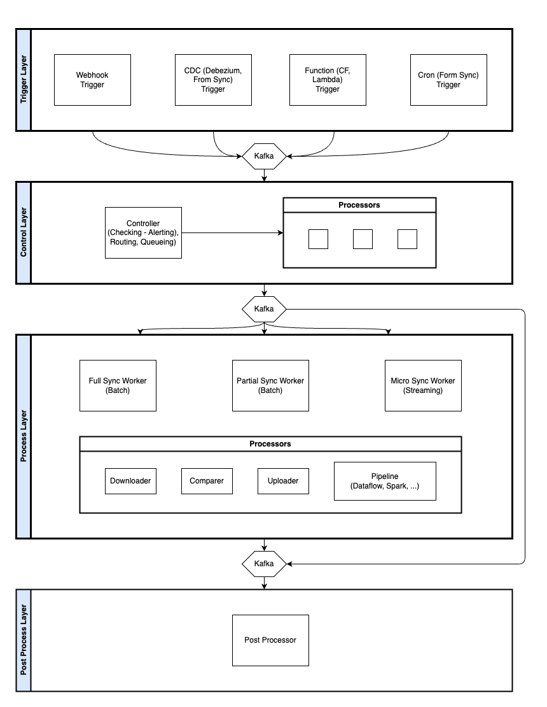

Starion Sync System (3S)
=================
Highly scalable data synchronization system built for Starion.

## Architecture
Kiến trúc tổng quát của 3S được phân chia thành 4 layer chính tương ứng với các giai đoạn của một luồng đồng bộ dữ liệu hoàn chỉnh. Mỗi layer bao gồm các service đặc thù được thiết kế để chỉ thực hiện một loại công việc cụ thể (trong ngữ cảnh của layer).
Các service trong cùng một layer không bao giờ trực tiếp giao tiếp với nhau (ngoại trừ trường hợp sử dụng các processor service) và chỉ có thể nhận hoặc bắn ra các event (từ/tới các layer khác thông qua một *event streaming platform* như Kafka). Theo đó, mỗi service chỉ tập trung vào thực hiện nhiệm vụ của mình (trong [Syncflow](#syncflow)) mà không phải quan tâm đến các thực thể khác, ta cũng tránh được sự phức tạp khó kiểm soát của kiến trúc hướng sự kiện khi các event chỉ được trung chuyển theo một chiều qua các layer.
### Syncflow
Khái niệm Syncflow để chỉ tương ứng với một luồng đồng bộ dữ liệu từ data source này sang data source khác. Do tính chất đa dạng của các loại data source, cách thức đồng bộ, chiều đồng bộ, v.v.. nên Syncflow sẽ có nhiều loại và được sinh ra bởi việc kết hợp các thuộc tính trên. 
 - **Datasource**: Air Table, Google Sheet, Excel, MySQL, MongoDB, ElasticSearch,... (kèm theo định danh data source).
 - **Direction**: Sync (external data source -> Starion database), Reverse Sync  (Starion database -> external data source).
 - **Sync type**: Full (batching), Partial (batching), Micro (streaming).
 Ví dụ, ta có một Syncflow sau: MySQL-Sync-Micro.
### Trigger Layer
Trigger layer bao gồm những service có thể bắn ra những event nhằm thông báo một Syncflow cần được thực thi (trigger). Các trigger có thể đến từ rất đa dạng các nơi (data source) và dưới nhiều hình thức (Webhook, Log based event, cloud function event, cron job event,...) xong đều được các trigger service thu thập và chuyển tới Controller Layer dưới dạng event kafka.
### Controller Layer
Controller có các nhiệm vụ chính sau:
 - Kiểm tra và quyết định Syncflow có được thực thi hay không (do một số nguyên nhân như vượt quá plan limit, có Syncflow khác của cùng data source đang thực thi).
 - Tiền xử lý hoặc chuẩn hoá Syncflow data/event (nếu cần) thông qua processor.
 - Điều phối (routing) Syncflow event tới topic thích hợp để tới Processing layer hoặc Post-processing layer nếu Syncflow bị từ chối.
### Processing Layer
Quá trình ETL (Extract - Transform - Load) dữ liệu sẽ hoàn toàn được xử lý tại đây nhờ những worker service kết hợp với các processor service.
 - **Full Sync Worker**: Sync toàn bộ dữ liệu của data source (batch processing).
- **Partial Sync Worker**: Sync một phần dữ liệu của data source (batch processing).
- **Micro Sync Worker**: Sync một phần rất nhỏ dữ liệu của data source (stream processing).
Các processor có thể là những service tự xây dựng hoặc những pipeline ETL chạy trên các runner như Dataflow, Spark, Flink,... Đặc điểm chung của các processor là nó phải là stateless và có thể xử lý được workload lớn, đòi hỏi hiệu năng cao.
### Post-processing Layer
Layer này đảm nhiệm thêm các xử lý phát sinh khi Syncflow có lỗi xảy ra, hoặc các xử lý khác liên quan đến phân tích, thống kê, business logic... 
## Installing

## Quick start

## Documentation

## Building from source

### Dependencies

### Building

### Testing

## Development

### TODO

### Coding convention

## Links

## Credits
